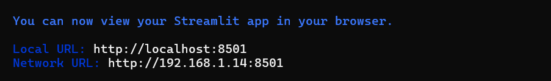
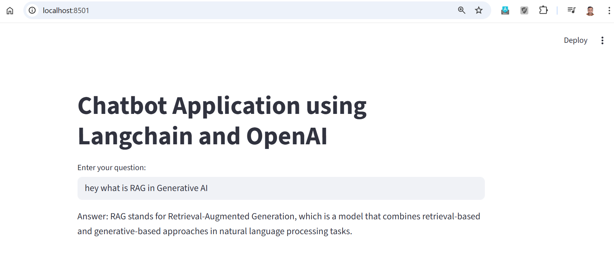

# LangChain Chatbot Application

A modern, interactive chatbot application built with **LangChain**, **OpenAI GPT-3.5-turbo**, and **Streamlit**. This application demonstrates the power of LangChain's LangChain Expression Language (LCEL) for building production-ready AI applications with minimal code.

## 📋 Table of Contents

- [Overview](#overview)
- [Usage](#usage)
- [Technology Stack](#technology-stack)
- [High-Level Architecture](#high-level-architecture)
- [Features](#features)
- [Prerequisites](#prerequisites)
- [Installation](#installation)
- [Configuration](#configuration)
- [Architecture Details](#architecture-details)
- [Component Breakdown](#component-breakdown)
- [Project Structure](#project-structure)
- [License](#license)

## 🎯 Overview

This chatbot application provides a user-friendly web interface for interacting with OpenAI's GPT-3.5-turbo model through LangChain. The application leverages LangChain's powerful abstractions to create a clean, maintainable, and extensible chatbot system. It demonstrates best practices for building AI applications with proper prompt engineering, output parsing, and observability.

### Key Highlights

- **Simple yet Powerful**: Minimal code with maximum functionality
- **Production-Ready**: Includes LangChain tracing for observability
- **User-Friendly**: Clean Streamlit interface for seamless interaction
- **Extensible**: Built on LangChain's modular architecture for easy customization
- **Best Practices**: Follows LangChain's recommended patterns and conventions

## 🎮 Usage

### Running the Application

1. **Activate your virtual environment** (if using one):
   ```bash
   # Windows
   venv\Scripts\activate
   
   # macOS/Linux
   source venv/bin/activate
   ```

2. **Start the Streamlit application**:
   ```bash
   streamlit run app.py
   ```

3. **Access the application**:
   - The app will automatically open in your default web browser
   - Default URL: `http://localhost:8501`

### Using the Chatbot

1. **Enter your question** in the text input field
2. **Press Enter** or wait for the response
3. **View the AI-generated response** displayed below the input field
4. **Ask follow-up questions** by entering new queries

### Example Interactions

**Question**: "What is machine learning?"

**Response**: [AI-generated explanation about machine learning]

**Question**: "Explain neural networks in simple terms"

**Response**: [AI-generated explanation about neural networks]

### Application Screenshot

The following screenshot demonstrates the chatbot application in action,
on running the command would get below output



the web user interface and a sample interaction:



**What the screenshot shows:**
- **Application Title**: "Chatbot Application using Langchain and OpenAI" displayed prominently
- **User Input**: Example query "hey what is RAG in Generative AI" entered in the input field
- **AI Response**: The chatbot provides a concise answer: "RAG stands for Retrieval-Augmented Generation, which is a model that combines retrieval-based and generative-based approaches in natural language processing tasks."
- **Clean Interface**: Minimalist design with white background and dark gray text for optimal readability
- **Local Server**: Running on `localhost:8501` as indicated in the browser URL bar

This demonstrates the application's ability to process user queries and provide accurate, informative responses using OpenAI's GPT-3.5-turbo model through LangChain.

> **Note**: If you don't have a screenshot file yet, you can:
> 1. Run the application: `streamlit run app.py`
> 2. Take a screenshot of the running application
> 3. Save it as `screenshot.png` in the `chatbot` directory
> 4. The image will automatically display in the README

## 🛠️ Technology Stack

This application is built using a modern, production-ready technology stack designed for building AI-powered applications. The stack emphasizes modularity, ease of use, and seamless integration between components.

### Core Technologies

#### 1. Python 3.8+
- **Role**: Primary programming language
- **Why**: Python's extensive ecosystem, readability, and strong support for AI/ML libraries make it ideal for LLM applications
- **Features Used**: 
  - Object-oriented programming
  - Environment variable handling
  - Module imports and package management

#### 2. LangChain Framework
- **Role**: Core framework for building LLM-powered applications
- **Version**: Latest stable release
- **Components Used**:
  - **LangChain Expression Language (LCEL)**: Declarative syntax for composing chains
  - **Prompt Templates**: Structured prompt management
  - **Output Parsers**: Response formatting and validation
  - **Chain Composition**: Pipeline orchestration

##### LangChain Packages

| Package | Purpose | Key Features |
|---------|---------|--------------|
| `langchain_openai` | OpenAI API integration | - ChatOpenAI model wrapper<br>- GPT-3.5-turbo support<br>- Temperature and parameter control<br>- Streaming capabilities |
| `langchain_core` | Core abstractions and utilities | - ChatPromptTemplate<br>- StrOutputParser<br>- Chain interfaces<br>- Runnable protocol |

**LangChain Benefits**:
- **Modularity**: Each component can be independently configured and replaced
- **Composability**: Easy chain construction using LCEL pipe operator (`|`)
- **Observability**: Built-in tracing and monitoring via LangSmith
- **Extensibility**: Simple to add custom components or integrate with other tools

#### 3. Streamlit
- **Role**: Web framework for building interactive user interfaces
- **Version**: Latest stable release
- **Features Used**:
  - `st.title()`: Application header
  - `st.text_input()`: User input field
  - `st.write()`: Response display
  - Automatic page refresh and state management

**Streamlit Benefits**:
- **Rapid Development**: Build web apps with pure Python
- **No Frontend Knowledge Required**: No HTML, CSS, or JavaScript needed
- **Interactive**: Automatic UI updates on user input
- **Deployment Ready**: Easy deployment to Streamlit Cloud, AWS, etc.

#### 4. python-dotenv
- **Role**: Environment variable management
- **Version**: Latest stable release
- **Purpose**: Secure loading of API keys and configuration from `.env` files
- **Security**: Prevents hardcoding sensitive credentials in source code

### Technology Stack Architecture

```
┌─────────────────────────────────────────────────────────┐
│                    Technology Layers                     │
├─────────────────────────────────────────────────────────┤
│  Presentation Layer                                      │
│  └─ Streamlit (Web UI Framework)                        │
├─────────────────────────────────────────────────────────┤
│  Application Layer                                       │
│  └─ Python 3.8+ (Runtime Environment)                   │
├─────────────────────────────────────────────────────────┤
│  Framework Layer                                         │
│  ├─ LangChain Core (Chain Composition)                 │
│  ├─ LangChain OpenAI (LLM Integration)                 │
│  └─ python-dotenv (Configuration Management)            │
├─────────────────────────────────────────────────────────┤
│  External Services                                       │
│  ├─ OpenAI API (GPT-3.5-turbo)                        │
│  └─ LangSmith (Tracing & Observability)                │
└─────────────────────────────────────────────────────────┘
```

### Detailed Library Breakdown

#### Frontend & UI
- **Streamlit**: 
  - Provides the entire web interface
  - Handles user interactions
  - Manages application state
  - Runs on local server (default: `localhost:8501`)

#### Backend & Logic
- **Python Standard Library**:
  - `os`: Environment variable access
  - Built-in data structures for chain composition

#### AI & ML Framework
- **LangChain**:
  - **ChatPromptTemplate**: Creates structured prompts with system and user messages
  - **ChatOpenAI**: Wrapper around OpenAI's Chat API
  - **StrOutputParser**: Converts LLM responses to clean strings
  - **LCEL Chains**: Composable pipeline using pipe operator

#### Configuration & Security
- **python-dotenv**:
  - Loads environment variables from `.env` file
  - Prevents credential exposure in code
  - Supports different environments (dev, staging, prod)

### Integration Flow

```
User Input (Streamlit)
    ↓
Python Application Logic
    ↓
LangChain Chain (LCEL)
    ├─ Prompt Template (langchain_core)
    ├─ LLM Wrapper (langchain_openai)
    └─ Output Parser (langchain_core)
    ↓
OpenAI API (External Service)
    ↓
Response Processing
    ↓
Display in Streamlit UI
```

### Version Compatibility

| Technology | Minimum Version | Recommended Version |
|------------|----------------|---------------------|
| Python | 3.8 | 3.10+ |
| langchain_openai | 0.1.0+ | Latest |
| langchain_core | 0.1.0+ | Latest |
| streamlit | 1.28.0+ | Latest |
| python-dotenv | 1.0.0+ | Latest |

### Why This Stack?

1. **LangChain**: Industry-standard framework for LLM applications with extensive documentation and community support
2. **Streamlit**: Fastest way to build interactive web interfaces for Python applications
3. **OpenAI GPT-3.5-turbo**: Cost-effective, fast, and reliable language model
4. **python-dotenv**: Best practice for managing sensitive configuration
5. **Python**: Most popular language for AI/ML with rich ecosystem

### Alternative Technologies

While this application uses the technologies listed above, here are some alternatives you might consider:

- **UI Framework**: Gradio, Flask, FastAPI, React (for more complex UIs)
- **LLM Provider**: Anthropic Claude, Google Gemini, Local models (Ollama, LlamaCpp)
- **Framework**: LlamaIndex, Haystack, Custom implementations
- **Configuration**: TOML files, YAML files, Cloud secret managers (AWS Secrets Manager, Azure Key Vault)

### Dependencies Installation

All required packages can be installed via:

```bash
pip install langchain_openai langchain_core streamlit python-dotenv
```

Or using the requirements file:

```bash
pip install -r ../requirements.txt
```

## 🏗️ High-Level Architecture

```
┌─────────────────────────────────────────────────────────────┐
│                     User Interface Layer                    │
│                    (Streamlit Web App)                      │
│  ┌──────────────────────────────────────────────────────┐   │
│  │  Title: "Chatbot Application using Langchain..."     │   │
│  │  Input Field: User Question Entry                    │   │
│  │  Output Display: AI Response                         │   │
│  └──────────────────────────────────────────────────────┘   │
└───────────────────────────┬─────────────────────────────────┘
                            │
                            ▼
┌─────────────────────────────────────────────────────────────┐
│                    Application Logic Layer                  │
│  ┌──────────────────────────────────────────────────────┐   │
│  │  LangChain Expression Language (LCEL) Chain          │   │
│  │  prompt | llm | output_parser                        │   │
│  └──────────────────────────────────────────────────────┘   │
└───────────────────────────┬─────────────────────────────────┘
                            │
                            ▼
┌───────────────────────────────────────────────────────────┐
│                      LangChain Components                 │
│  ┌──────────────┐  ┌──────────────┐  ┌──────────────┐     │
│  │   Prompt     │  │      LLM     │  │    Output    │     │
│  │  Template    │→ │   (OpenAI    │→ │   Parser     │     │
│  │              │  │  GPT-3.5)    │  │              │     │
│  └──────────────┘  └──────────────┘  └──────────────┘     │
└───────────────────────────┬───────────────────────────────┘
                            │
                            ▼
┌────────────────────────────────────────────────────────────┐
│                    External Services Layer                 │
│  ┌──────────────────────┐  ┌──────────────────────┐        │
│  │   OpenAI API         │  │  LangChain Tracing   │        │
│  │  (GPT-3.5-turbo)     │  │  (Observability)     │        │
│  └──────────────────────┘  └──────────────────────┘        │
└────────────────────────────────────────────────────────────┘
```

### Architecture Principles

1. **Separation of Concerns**: Clear separation between UI, business logic, and external services
2. **Modularity**: Each component (prompt, LLM, parser) is independently configurable
3. **Observability**: Built-in tracing for debugging and monitoring
4. **Scalability**: LCEL chains can be easily extended with additional components
5. **Maintainability**: Clean, readable code following LangChain best practices

## ✨ Features

- **Interactive Chat Interface**: Clean, responsive web UI built with Streamlit
- **OpenAI Integration**: Powered by GPT-3.5-turbo for high-quality responses
- **Prompt Engineering**: Structured prompt template with system and user messages
- **Output Parsing**: Automatic string parsing for clean response formatting
- **LangChain Tracing**: Built-in observability for debugging and monitoring
- **Environment-Based Configuration**: Secure API key management via environment variables
- **LCEL Chain Composition**: Elegant chain construction using LangChain Expression Language

## 📦 Prerequisites

Before you begin, ensure you have the following installed:

1. **Python 3.8 or higher**
   ```bash
   python --version
   ```

2. **OpenAI API Key**
   - Sign up at [OpenAI](https://platform.openai.com/)
   - Generate an API key from your dashboard
   - Ensure you have sufficient credits

3. **LangChain API Key** (Optional, for tracing)
   - Sign up at [LangSmith](https://smith.langchain.com/)
   - Generate an API key for tracing and observability

4. **pip** (Python package manager)

## 🚀 Installation

### Step 1: Clone the Repository

```bash
git clone <your-repository-url>
cd LANGCHAIN/chatbot
```

### Step 2: Create Virtual Environment (Recommended)

```bash
# Windows
python -m venv venv
venv\Scripts\activate

# macOS/Linux
python -m venv venv
source venv/bin/activate
```

### Step 3: Install Dependencies

```bash
pip install -r ../requirements.txt
```

Or install individually:

```bash
pip install langchain_openai langchain_core streamlit python-dotenv
```

## ⚙️ Configuration

### Environment Variables Setup

Create a `.env` file in the `chatbot` directory with the following variables:

```env
# OpenAI Configuration
OPENAI_API_KEY=your_openai_api_key_here

# LangChain Tracing (Optional but Recommended)
LANGCHAIN_API_KEY=your_langchain_api_key_here
LANGCHAIN_PROJECT=your_project_name_here

# LangChain Tracing Enable
LANGCHAIN_TRACING_V2=true
```

### Environment Variables Explained

| Variable | Required | Description |
|----------|----------|-------------|
| `OPENAI_API_KEY` | **Yes** | Your OpenAI API key for accessing GPT-3.5-turbo |
| `LANGCHAIN_API_KEY` | No | LangSmith API key for tracing and observability |
| `LANGCHAIN_PROJECT` | No | Project name in LangSmith dashboard |
| `LANGCHAIN_TRACING_V2` | No | Enable/disable LangChain tracing (set to "true") |

### Security Best Practices

- **Never commit `.env` files** to version control
- Add `.env` to your `.gitignore` file
- Use environment-specific configuration for production
- Rotate API keys regularly
- Use secret management services for production deployments

## 🔍 Architecture Details

### LangChain Expression Language (LCEL)

The application uses LCEL, LangChain's declarative language for composing chains:

```python
chain = prompt | llm | output_parser
```

This syntax creates a pipeline where:
1. User input flows through the **prompt template**
2. The formatted prompt is sent to the **LLM**
3. The LLM response is parsed by the **output parser**
4. The final string is returned to the user

### Chain Execution Flow

```
User Input
    ↓
ChatPromptTemplate.from_messages()
    ↓
[System Message: "You are a helpful assistant..."]
[User Message: "Question: {user_input}"]
    ↓
ChatOpenAI (GPT-3.5-turbo)
    ↓
LLM Response (Raw)
    ↓
StrOutputParser
    ↓
Formatted String Response
    ↓
Streamlit Display
```

### Invocation Pattern

The chain uses the `.invoke()` method for synchronous execution:

```python
chain.invoke({"question": user_input})
```

This pattern:
- Accepts a dictionary with input variables
- Executes the entire chain pipeline
- Returns the parsed output
- Is suitable for interactive applications

## 🧩 Component Breakdown

### 1. Prompt Template

```python
prompt = ChatPromptTemplate.from_messages([
    ("system", "You are a helpful assistant..."),
    ("user", "Question: {question}")
])
```

**Purpose**: Defines the conversation structure and system instructions

**Components**:
- **System Message**: Sets the AI's role and behavior
- **User Message**: Template for user queries with variable substitution

**Benefits**:
- Consistent prompt structure
- Easy to modify system instructions
- Supports multi-turn conversations (extensible)

### 2. Language Model (LLM)

```python
llm = ChatOpenAI(model="gpt-3.5-turbo", temperature=0)
```

**Purpose**: Interface to OpenAI's GPT-3.5-turbo model

**Parameters**:
- `model`: Specifies GPT-3.5-turbo (cost-effective, fast)
- `temperature=0`: Ensures deterministic, focused responses

**Temperature Explanation**:
- `0`: Most deterministic, factual
- `0.7`: Balanced creativity and consistency
- `1.0+`: More creative, less consistent

### 3. Output Parser

```python
output_parser = StrOutputParser()
```

**Purpose**: Converts LLM response to a clean string format

**Functionality**:
- Handles response formatting
- Removes unnecessary metadata
- Ensures consistent output type

### 4. Streamlit Interface

```python
st.title("Chatbot Application using Langchain and OpenAI")
user_input = st.text_input("Enter your question:")
```

**Purpose**: Provides web-based user interface

**Components**:
- **Title**: Application header
- **Text Input**: User query entry field
- **Write**: Response display area

**Features**:
- Automatic page refresh on input
- Clean, minimal UI
- Responsive design

## 📊 LangChain Tracing

### What is LangChain Tracing?

LangChain tracing provides observability into your LLM application's execution. It logs:
- Prompt inputs and outputs
- LLM API calls and responses
- Chain execution flow
- Latency metrics
- Token usage

### Enabling Tracing

Tracing is enabled in the code:

```python
os.environ["LANGCHAIN_TRACING_V2"] = "true"
os.environ["LANGCHAIN_API_KEY"] = os.getenv("LANGCHAIN_API_KEY")
os.environ["LANGCHAIN_PROJECT"] = os.getenv("LANGCHAIN_PROJECT")
```

### Viewing Traces

1. Visit [LangSmith Dashboard](https://smith.langchain.com/)
2. Navigate to your project
3. View detailed execution traces
4. Analyze performance and debug issues

### Benefits

- **Debugging**: Identify issues in prompt or chain logic
- **Optimization**: Analyze latency and token usage
- **Monitoring**: Track application performance over time
- **Cost Analysis**: Monitor API usage and costs

## 📁 Project Structure

```
chatbot/
│
├── app.py                 # Main application file (OpenAI version)
└── README.md             # This file

../
│
├── requirements.txt      # Python dependencies
└── .env                 # Environment variables (not in repo)
```

### File Descriptions

- **`app.py``**: Main chatbot application using OpenAI GPT-3.5-turbo
- **`locallama.py`**: Alternative implementation using local Ollama models
- **`trial.ipynb`**: Jupyter notebook for testing and experimentation

### Potential Improvements

1. **Conversation History**
   - Maintain chat history across interactions
   - Support multi-turn conversations
   - Add conversation context management

2. **Advanced Prompting**
   - Support for few-shot examples
   - Dynamic prompt selection
   - Prompt versioning

## 🐛 Troubleshooting

### Common Issues

#### 1. API Key Errors

**Error**: `OpenAI API key not found`

**Solution**:
- Verify `.env` file exists in the `chatbot` directory
- Check that `OPENAI_API_KEY` is set correctly
- Ensure no extra spaces or quotes around the key
- Restart the application after updating `.env`

#### 2. Module Not Found

**Error**: `ModuleNotFoundError: No module named 'langchain_openai'`

**Solution**:
```bash
pip install langchain_openai langchain_core streamlit python-dotenv
```

#### 3. Streamlit Not Starting

**Error**: `Streamlit app not launching`

**Solution**:
- Check if port 8501 is available
- Try: `streamlit run app.py --server.port 8502`
- Verify Streamlit installation: `streamlit --version`

#### 4. LangChain Tracing Not Working

**Error**: Traces not appearing in LangSmith

**Solution**:
- Verify `LANGCHAIN_API_KEY` is set
- Check `LANGCHAIN_PROJECT` name matches your LangSmith project
- Ensure `LANGCHAIN_TRACING_V2` is set to `"true"` (string, not boolean)

#### 5. Slow Response Times

**Possible Causes**:
- Network latency to OpenAI API
- Large prompt sizes
- API rate limiting

**Solutions**:
- Check internet connection
- Monitor API status at [status.openai.com](https://status.openai.com)
- Consider using streaming responses

### Getting Help

- Check [LangChain Documentation](https://python.langchain.com/)
- Review [Streamlit Documentation](https://docs.streamlit.io/)
- Visit [OpenAI API Documentation](https://platform.openai.com/docs)
- Open an issue in the repository

## 📄 License

This project is open source and available under the [MIT License](LICENSE).

---

**Built with ❤️ using LangChain, OpenAI, and Streamlit**

*Last Updated: 2026*

